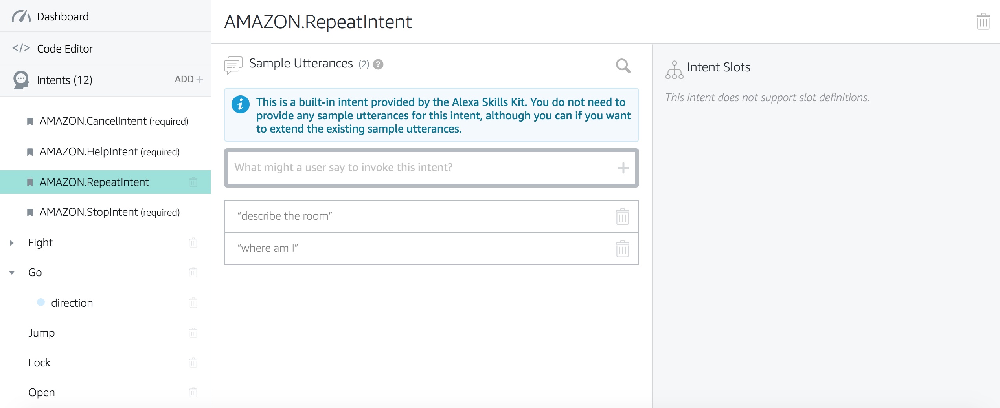

# Build An Alexa Gamebook Skill
[](./1-voice-user-interface.md)[](./2-lambda-function.md)[](./3-connect-vui-to-code.md)[](./4-testing.md)[](./5-customization.md)[](./6-publication.md)

## Setting Up Your Alexa Skill In The Developer Portal

There are two parts to an Alexa Skill: **Voice User Interface (VUI)** and **code logic**.  The first part is the [VUI](https://developer.amazon.com/public/solutions/alexa/alexa-skills-kit/docs/defining-the-voice-interface) which we will create here.  This is where we define how to interpret a user's voice input and identify which actions they are asking for when specific phrases are spoken.  The output from the VUI will be a JSON message.

The second part is the code logic of our Skill. This will receive the VUI's message, act accordingly, and tell Alexa what she should say back to the user. We will handle that on page 2 of this guide.

1.  Go to the **[Amazon Developer Portal](http://developer.amazon.com)**.  In the top-right corner of the screen, click the **Sign In** button. </br>(If you don't already have an account, you will be able to create a new one for free.)

    <a href="http://developer.amazon.com" target="_new"></a>

2.  Once you have signed in, click the **Alexa** button at the top of the screen.

    <a href="https://developer.amazon.com/edw/home.html#/" target="_new"></a>

3.  On the Alexa page, choose the **Get Started** button for the **Alexa Skills Kit**.

    <a href="https://developer.amazon.com/edw/home.html#/skills/list" target="_new"></a>

4.  Select **Add A New Skill**.

    <a href="https://developer.amazon.com/edw/home.html#/skill/create/" target="_new"></a>

5.  Fill out the **Skill Information** screen.  Make sure to review the **Skill Information Tips** below this screenshot.

    

    ### Skill Information Tips
    1.  **Skill Type** We are creating a skill using the Custom Interaction Model.  This is the default choice.

    2.  **Language** Choose the first language you want to support.  You can add additional languages in the future.  This guide is using 'English (U.S.) to start. If you are in the UK use 'English (U.K.)'. This should match the default language of your Alexa device if you are using one.

    3.  **Name** This will be shown in the Alexa Skills Store and be the name your users will refer to.

    4.  **Invocation Name** This is the name that your users will say to start your skill.  It will consist of 2+ common language words. Full details can be found in the [Invocation Name Requirements](https://developer.amazon.com/public/solutions/alexa/alexa-skills-kit/docs/choosing-the-invocation-name-for-an-alexa-skill). Some of the common issues are shown below.

        | Invocation Name Requirements | Examples of incorrect invocation names |
        | ---------------------------- | -------------------------------------- |
        | The skill invocation name must not infringe upon the intellectual property rights of an entity or person. | korean air; septa check |
        | Invocation names should be more than one word (unless it is a brand or intellectual property), and must not be a name or place | horoscope; trivia; guide; new york |
        | Two word invocation names are not allowed when one of the words is a definite article, indefinite article, or a preposition | any poet; the bookie; the fool |
        | The invocation name must not contain any of the Alexa skill launch phrases and connecting words.  Launch phrase examples include "launch," "ask," "tell," "load," and "begin."  Connecting word examples include "to," "from," "by," "if," "and," "whether." | trivia game for star wars; better with bacon |
        | The invocation name must not contain the wake words "Alexa," "Amazon," "Echo," or the words "skill" or "app." | hackster initial skill; word skills |
        | The invocation name must be written in each language you choose to support.  For example, the German version of your skill must have an invocation name written in German, while the English (US) version must have an invocation name written in English. | kitchen stories (German skill) |

    5.  **Audio Player** We are not using audio files for this skill. You can select **No** for this option.  Learn more about adding audio to your skills in our [Audio Player Guide](https://github.com/alexa/skill-sample-nodejs-audio-player).

6.  Click the **Next** button to move to the Interaction Model.

7.  Click on the **Launch Skill Builder BETA** button.

    

8.  Click on the **Code Editor** item in the menu on the left side.

9.  Drag and drop the file **[InteractionModel.json](../InteractionModel.json)** onto the area marked **Drag and drop your .json file** or copy and paste the contents of the file into the text box. Then click **Apply Changes** or **Save Model**.  

10. Click on the **Dashboard** menu item.

11. View the sample utterances for your newly generated intents.  These are all the different ways that a user can request to make a specific intent happen.  Examples for WhereAmIIntent are:

    ```text
    "hello"
    "where am I?"
    "describe the room"
    "repeat"
    ```

    In a professional skill these lists will need to be extensive, as you try to match as many ways as possible that users might ask. They must be unique across all of the intents.

    

11. Click on **Save Model** then **Build Model**.

    

    If you get an error from your interaction model: Did you copy and paste all of the provided code into the appropriate box?; Did you accidentally add any characters?

12.  When your interaction model builds successfully, click on **Configuration** to move on. In our next step of this guide, we will be creating our Lambda function in the AWS developer console, but keep this browser tab open, because we will be returning here on page 3 when we connect the VUI to the code.
     

<br/><br/>
<a href="./2-lambda-function.md"></a>


